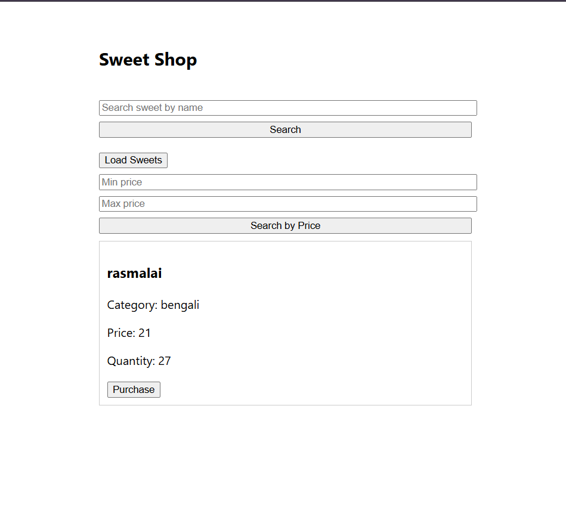
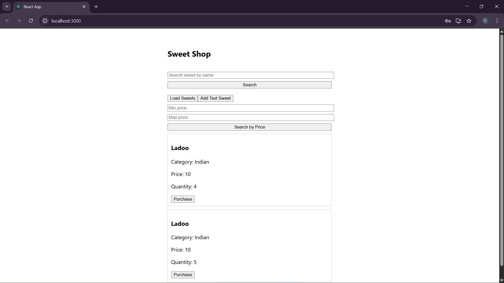
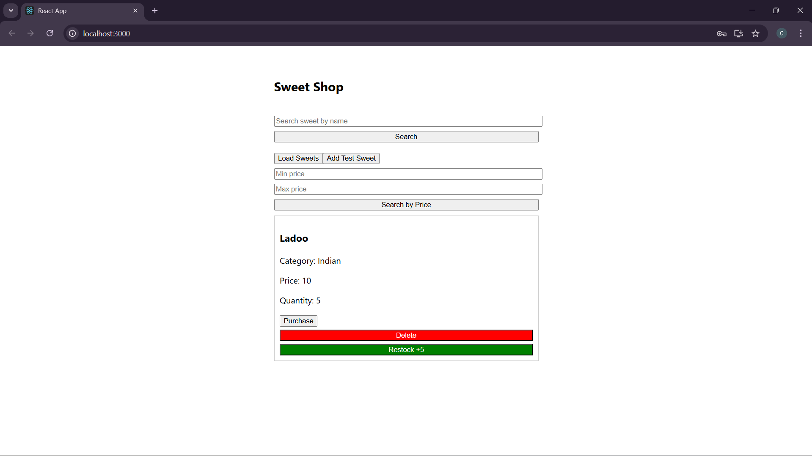
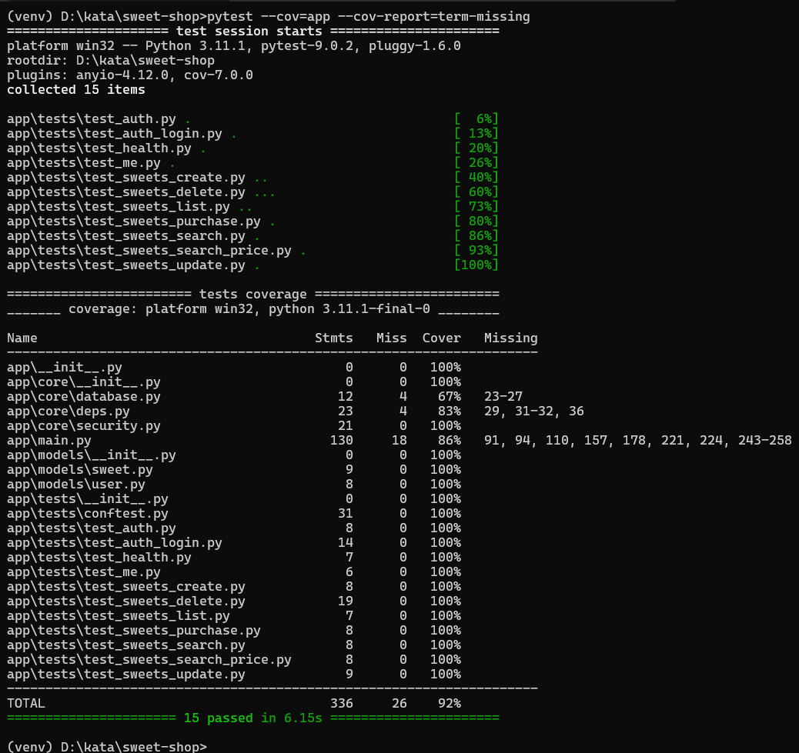
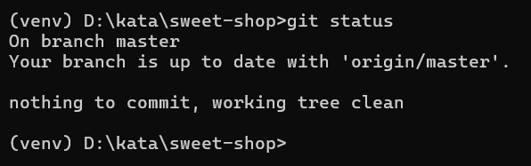

# Sweet Shop Management System


## Overview


The Sweet Shop Management System is a full-stack web application designed to manage sweets inventory for a shop.  

It allows users to view available sweets, search and purchase them, while admin users can manage inventory by adding, updating, restocking, and deleting sweets.


The project was built as a Test-Driven Development (TDD) kata, focusing on clean backend API design, authentication, authorization, and a modern React frontend.  

It demonstrates real-world practices such as JWT-based authentication, role-based access control (admin vs user), automated testing, and API-driven frontend development.


## Tech Stack


### Backend

- Python 3

- FastAPI

- SQLAlchemy

- SQLite

- JWT Authentication

- Pytest (with coverage)


### Frontend

- React (Create React App)
- JavaScript (ES6)
- Fetch API


### Tooling \& Dev Practices

- Test-Driven Development (TDD)

- Git \& GitHub

- AI-assisted development (documented)


## Features


### Authentication

- User registration and login

- JWT-based authentication

- Role-based access (Admin / Normal User)


### Sweet Management

- Add new sweets (Admin only)

- View all available sweets

- Update sweet details (price, quantity)

- Delete sweets (Admin only)


### Inventory Management

- Purchase sweets (quantity decreases)

- Restock sweets (Admin only)

- Purchase button disabled when out of stock


### Search \& Filtering

- Search sweets by name

- Search sweets by category

- Search sweets by price range


### Security

- Protected API routes using JWT

- Admin-only access enforced on sensitive operations


## API Endpoints


### Authentication

| Method | Endpoint | Description |

|------|---------|-------------|

| POST | /api/auth/register | Register a new user |

| POST | /api/auth/login | Login and receive JWT token |

| GET  | /api/me | Get current logged-in user info |


### Sweets (Protected)

| Method | Endpoint | Description |

|------|---------|-------------|

| POST | /api/sweets | Add a new sweet (Admin only) |

| GET | /api/sweets | Get all sweets |

| GET | /api/sweets/search | Search sweets by name, category, or price |

| PUT | /api/sweets/{id} | Update sweet details |

| DELETE | /api/sweets/{id} | Delete a sweet (Admin only) |


### Inventory

| Method | Endpoint | Description |

|------|---------|-------------|

| POST | /api/sweets/{id}/purchase | Purchase a sweet |

| POST | /api/sweets/{id}/restock | Restock a sweet (Admin only) |


### Health Check

| Method | Endpoint | Description |

|------|---------|-------------|

| GET | /health | Backend health check |


## How to Run the Project Locally


### Prerequisites

- Python 3.10+

- Node.js 18+

- npm

- Git


---


### Backend Setup


```bash

# Clone the repository

git clone <your-repo-url>

cd sweet-shop


# Create virtual environment

python -m venv venv


# Activate virtual environment

# Windows

venv\\Scripts\\activate

# Mac/Linux

source venv/bin/activate


# Install backend dependencies

pip install -r requirements.txt


# Run backend server

uvicorn app.main:app --reload


Backend will be available at:


http://localhost:8000


Frontend Setup


cd frontend


# Install dependencies

npm install


# Start frontend

npm start


Frontend will be available at:


http://localhost:3000


## My AI Usage


I used ChatGPT as an AI assistant throughout the development of this project.


### Tools Used

- ChatGPT (OpenAI)


### How I Used AI

- To understand the assignment requirements and break them down into backend and frontend tasks.

- To design REST API endpoints using FastAPI and ensure they matched the specification.

- To write and debug backend logic including authentication, authorization, and database interactions.

- To write and fix pytest test cases following a Test-Driven Development (TDD) approach.

- To debug failing tests and understand error messages.

- To integrate the React frontend with the backend API.

- To resolve frontend issues related to state management, API calls, and conditional rendering.

- To understand CORS issues and properly configure the backend.

- To review and validate my final code structure and implementation.


### Reflection

Using AI significantly improved my development workflow. It helped me debug issues faster, understand unfamiliar concepts more clearly, and stay aligned with best practices.  

All code was reviewed, understood, and integrated by me, and AI was used strictly as an assistant rather than a replacement for my own work.


## 📸 Screenshots

### Project Setup & API


### Authentication


### Customer Experience





### Admin Experience




### Development Progress


### Testing



### Git & Version Control





